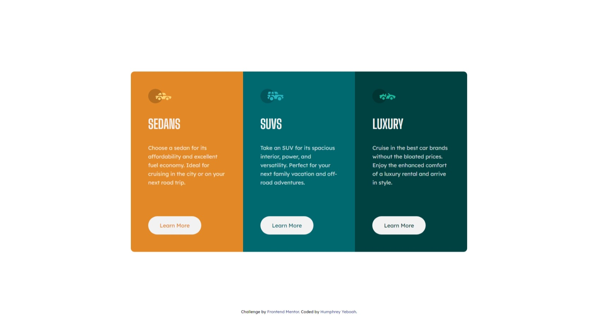

<!-- @format -->

# Frontend Mentor - 3-column preview card component solution

This is a solution to the [3-column preview card component challenge on Frontend Mentor](https://www.frontendmentor.io/challenges/3column-preview-card-component-pH92eAR2-). Frontend Mentor challenges help you improve your coding skills by building realistic projects.

## Table of contents

- [Overview](#overview)
  - [The challenge](#the-challenge)
  - [Screenshot](#screenshot)
  - [Links](#links)
- [My process](#my-process)
  - [Built with](#built-with)
  - [What I learned](#what-i-learned)
- [Author](#author)

## Overview

### The challenge

Users should be able to:

- View the optimal layout depending on their device's screen size
- See hover states for interactive elements

### Screenshot



### Links

- Solution URL: [Github repo for solution](https://github.com/hakylepremier/3-column-card-component)
- Live Site URL: [Live site link](https://hakylepremier.github.io/3-column-card-component)

## My process

### Built with

- Semantic HTML5 markup
- CSS custom properties
- Flexbox

### What I learned

For this project I learnt that when using flex some elements make behave like block elements which will throw you off a bit but align items start will most likely help:

```
.card{
  align-items: start;
}
```

## Author

- Website - [Humphrey Yeboah](https://www.humphreyyeboah.com)
- Frontend Mentor - [@hakylepremier](https://www.frontendmentor.io/profile/hakylepremier)
- Twitter(X) - [@hakylepremier](https://www.twitter.com/hakylepremier)
